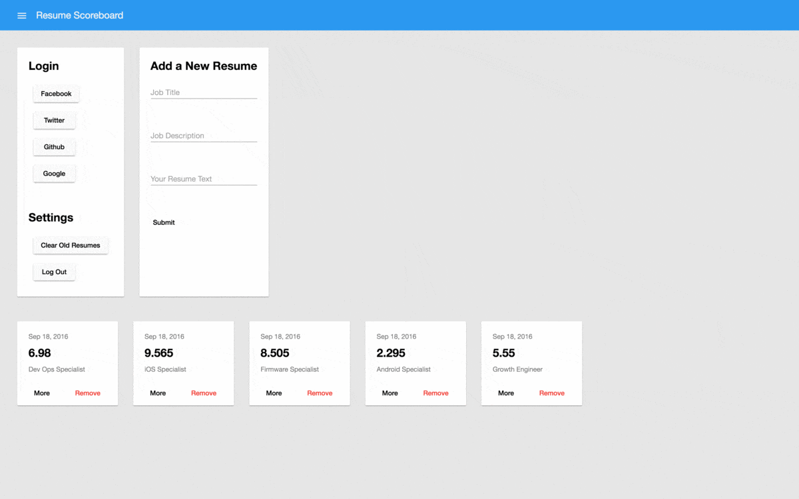

#Resume Scoreboard

Score your resume against the jobs you want. Make sure you rank at the top of recruiter's resume searches.

Features

[x] Signup and Login with Facebook, Twitter, Google, or GitHub thanks to Firebase OAuth
[x] Copy in your dream job title and description from any website or job board
[x] Copy in your resume text, just click and drag across any PDF
[x] Submit and see your latest score appear below
[ ] Click more on generated scores to see insights and areas to improve
[ ] Keep resume text saved so you don't have to copy in every time

Built at Hack the North 2016 in Waterloo with:
- Angular 2
- angular-cli
- Firebase (OAuth login and realtime data storage)
- AngularFire
- Angular Material 2

<!-- # ResumeScoreboard

This project was generated with [angular-cli](https://github.com/angular/angular-cli) version 1.0.0-beta.14.

## Development server
Run `ng serve` for a dev server. Navigate to `http://localhost:4200/`. The app will automatically reload if you change any of the source files.

## Code scaffolding

Run `ng generate component component-name` to generate a new component. You can also use `ng generate directive/pipe/service/class`.

## Build

Run `ng build` to build the project. The build artifacts will be stored in the `dist/` directory. Use the `-prod` flag for a production build.

## Running unit tests

Run `ng test` to execute the unit tests via [Karma](https://karma-runner.github.io).

## Running end-to-end tests

Run `ng e2e` to execute the end-to-end tests via [Protractor](http://www.protractortest.org/).
Before running the tests make sure you are serving the app via `ng serve`.

## Deploying to Github Pages

Run `ng github-pages:deploy` to deploy to Github Pages.

## Further help

To get more help on the `angular-cli` use `ng --help` or go check out the [Angular-CLI README](https://github.com/angular/angular-cli/blob/master/README.md). -->
